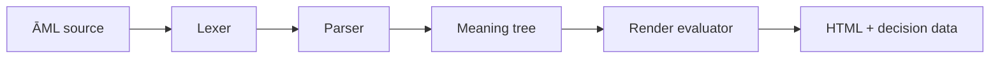

# ĀML™

## A meaning-native interface language for accountable rendering

[](https://github.com/aruintelligence/aml-core/actions/workflows/ci.yml)
[](https://aruintelligence.github.io/aml-core/)
[](https://nodejs.org/)
[](LICENSE)

ĀML™ is an experimental language, compiler, and browser demonstration built around a simple research question:

> Can an interface evaluate whether an element should consume attention before rendering it?

Traditional markup asks whether an element *can* render. ĀML adds an inspectable policy layer—EthicalRenderGate™—that asks whether its modeled restoration value justifies its modeled attention cost.

> **Status:** Working research prototype. The compiler, CLI, examples, runtime gate, live demonstration, and automated smoke tests are implemented. ĀML is not a production framework, a clinical evaluator, or a validated measure of cognitive impact.

## Try the live demonstration

[Open the interactive ĀML demo](https://aruintelligence.github.io/aml-core/).

The demo shows allowed, degraded, and suppressed rendering states; per-element inputs; restoration controls; before-and-after rendering; and generated decision data.

## Quick start

Requirements: Node.js 18 or newer.

```bash
git clone https://github.com/aruintelligence/aml-core.git
cd aml-core
npm test
node bin/aml.js compile examples/transmission-061.aml dist
```

The compiler writes inspectable artifacts to the output directory:

- `index.html`
- `tokens.json`
- `ast.json`
- `amt.json`
- `render_decision.json`

For CLI help:

```bash
node bin/aml.js help
```

## Core rule

The minimal prototype uses:

```text
render_allowed = restoration_value ≥ attention_cost
```

A near-threshold failure may render in a degraded mode; a larger failure is suppressed. These values are explicit model inputs. They are not measurements of a person or universal ethical truth.

## Example syntax

```aml
transmission "deep_focus" {

  engram DeepArticle {

    value:
      "Long-form restorative learning."

    purpose:
      "Increase coherence and understanding."

    attention_cost:
      3.2

    restoration_value:
      9.1

  }

}
```

The output includes both rendered HTML and a machine-readable accountability record.

## Implemented pipeline



| Component | Role |
|---|---|
| `bin/aml.js` | Command-line entry point |
| `compiler/lexer.js` | Tokenization |
| `compiler/parser.js` | Syntax parsing |
| `compiler/amtBuilder.js` | ĀRU Meaning Tree construction |
| `compiler/renderEvaluator.js` | Policy evaluation |
| `compiler/htmlGenerator.js` | Output generation |
| `runtime/ethicalRenderGate.js` | Standalone gate calculation |
| `test/aml-core.test.js` | Gate and end-to-end compiler smoke tests |
| `docs/index.html` | GitHub Pages demonstration |

## Verification

Every push and pull request runs the automated test suite and a CLI compilation check through GitHub Actions.

Run the same checks locally:

```bash
npm test
node bin/aml.js compile examples/transmission-061.aml dist
```

The tests currently verify:

- A restorative element passes the gate
- An attention-heavy element triggers fallback
- The compiler emits tokens, syntax data, a meaning tree, HTML, and render decisions

The suite is intentionally small. Parser edge cases, malformed input, accessibility behavior, and broader policy evaluation remain areas for additional testing.

## Evidence boundaries

ĀML demonstrates an implemented semantic-policy architecture. It does not establish that its scores objectively measure attention, restoration, harm, ethics, or wellbeing. Those dimensions require explicit operational definitions, empirical study, and independent scrutiny before real-world use.

See:

- [Architecture](ARCHITECTURE.md)
- [Language specification](LANGUAGE_SPEC.md)
- [Ethical rendering](ETHICAL_RENDERING.md)
- [Testing](TESTING.md)
- [Roadmap](ROADMAP.md)
- [White paper](WHITEPAPER.md)
- [Security policy](SECURITY.md)
- [Contribution guide](CONTRIBUTING.md)
- [Citation metadata](CITATION.cff)

## Current research directions

- More complete grammar and parser coverage
- Versioned policy definitions
- Explainable rendering decisions
- Accessibility-aware evaluation
- Adversarial tests and counterexamples
- Comparison with conventional design-system policy layers
- Empirical methods for evaluating attention and restoration assumptions

## Contributing

Reproducible bug reports, tests, documentation corrections, accessibility improvements, alternative scoring models, and critical counterexamples are welcome. Read [CONTRIBUTING.md](CONTRIBUTING.md) before proposing changes.

## Creator and stewardship

Created by **Daniel Jacob Read IV**. Stewarded by **ĀRU Intelligence Inc.**

## License and marks

The code is released under the [MIT License](LICENSE). ĀML™, EthicalRenderGate™, Meaning-Native Computing™, and ĀRU Intelligence Inc.™ may be claimed marks of their respective owner. The license governs use of the code; trademark rights are separate.
