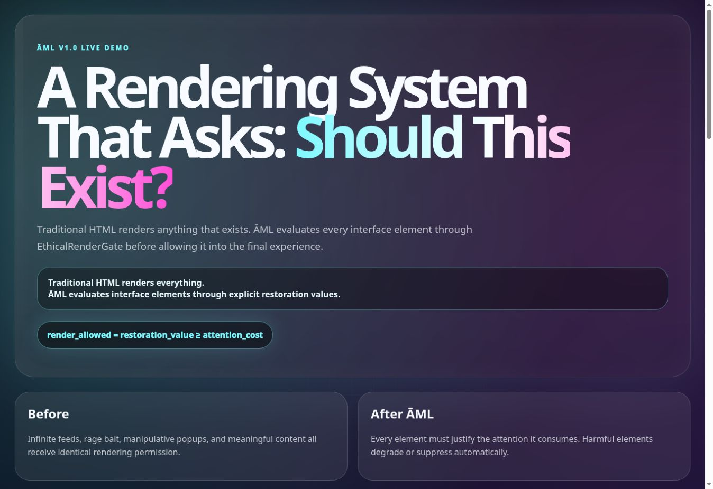
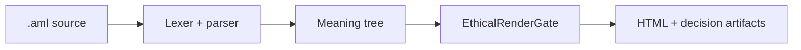

# ĀML™ — ĀRU Meaning Language™

## HTML asks whether it *can* render. ĀML asks whether it *should*.

[](https://github.com/aruintelligence/aml-core/actions/workflows/ci.yml)
[](https://aruintelligence.github.io/aml-core/)
[](https://nodejs.org/)
[](LICENSE)

**ĀML is a working research prototype for meaning-native, accountable interfaces.** It compiles semantic intent into browser-compatible output while producing an inspectable record of why each element was allowed, degraded, or suppressed.

> The web inherited a document language from another era. Intelligent interfaces need a decision layer.

[**Launch the EthicalRenderGate™ Lab →**](https://aruintelligence.github.io/aml-core/)

[](https://aruintelligence.github.io/aml-core/)

## The shift

| Legacy HTML substrate | ĀML accountability layer |
|---|---|
| Describes what exists | Declares what an element means |
| Renders when syntax is valid | Evaluates before rendering |
| Treats attention as free | Models attention as a cost |
| Leaves intent implicit | Exposes purpose and policy inputs |
| Produces a page | Produces a page **and** a decision record |
| Answers “Can this render?” | Answers “Should this render—and why?” |

ĀML does not pretend browsers have stopped speaking HTML. Today, it compiles to HTML, CSS, JavaScript, an Abstract Meaning Tree, and accountability artifacts. The innovation is the inspectable meaning-and-policy layer before browser rendering—not a claim that the browser substrate has vanished.

## The core experiment

The current EthicalRenderGate uses an intentionally simple, inspectable rule:

```text
render_allowed = restoration_value ≥ attention_cost
```

Near-threshold failures may degrade; larger failures are suppressed. The inputs are declared model values, not clinical measurements or universal ethical truth.

```aml
transmission "deep_focus" {
  engram DeepArticle {
    value: "Long-form restorative learning."
    purpose: "Increase coherence and understanding."
    attention_cost: 3.2
    restoration_value: 9.1
  }
}
```

## What runs today



- Working lexer, parser, Abstract Syntax Tree, and Abstract Meaning Tree
- CLI compilation and rendering commands
- Allowed, degraded, and suppressed render modes
- Browser laboratory with live policy inputs
- Machine-readable `render_decision.json`
- Automated gate and end-to-end compiler smoke tests
- GitHub Actions verification on pushes and pull requests

## Run it in under a minute

Requires Node.js 18 or newer.

```bash
git clone https://github.com/aruintelligence/aml-core.git
cd aml-core
npm test
node bin/aml.js compile examples/transmission-061.aml dist
```

The compiler emits:

```text
dist/
├── index.html
├── tokens.json
├── ast.json
├── amt.json
└── render_decision.json
```

For CLI help:

```bash
node bin/aml.js help
```

## Inspect the system

| Start here | What it contains |
|---|---|
| [Live Lab](https://aruintelligence.github.io/aml-core/) | Interactive HTML-versus-ĀML comparison and live decisions |
| [Manifesto](MANIFESTO.md) | Why accountable rendering matters |
| [Architecture](ARCHITECTURE.md) | Compiler and runtime structure |
| [Language specification](LANGUAGE_SPEC.md) | Current syntax and semantics |
| [Ethical rendering](ETHICAL_RENDERING.md) | Gate model and boundaries |
| [Testing](TESTING.md) | Reproducible verification |
| [Roadmap](ROADMAP.md) | Planned compiler and runtime work |
| [White paper](WHITEPAPER.md) | Research framing |
| [Contribution guide](CONTRIBUTING.md) | How to challenge or improve the work |

## What ĀML is—and is not

ĀML demonstrates an implemented semantic-policy architecture. It does **not** establish that its scores objectively measure attention, restoration, harm, ethics, or wellbeing. Those dimensions need operational definitions, empirical study, accessibility review, adversarial testing, and independent scrutiny before real-world use.

The project is best understood as an executable question:

> What changes when an interface must explain the attention it consumes?

## Build with us

Useful contributions include parser tests, malformed-input handling, accessibility work, alternate policy models, counterexamples, security review, and empirical evaluation methods. Read [CONTRIBUTING.md](CONTRIBUTING.md) and [SECURITY.md](SECURITY.md) before submitting work.

Created by **Daniel Jacob Read IV** and stewarded by **ĀRU Intelligence Inc.™**

Code is available under the [MIT License](LICENSE). ĀML™, ĀRU Meaning Language™, EthicalRenderGate™, Meaning-Native Computing™, and ĀRU Intelligence Inc.™ are claimed marks of ĀRU Intelligence Inc.; trademark rights are separate from the code license.
