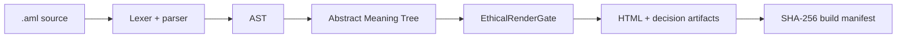

# ĀML™ — ĀRU Meaning Language™

## HTML asks whether it *can* render. ĀML asks whether it *should*.

[](https://github.com/aruintelligence/aml-core/actions/workflows/ci.yml)
[](https://aruintelligence.github.io/aml-core/playground.html)
[](https://aruintelligence.github.io/aml-core/)
[](CHANGELOG.md)
[](LICENSE)

**ĀML is a working research prototype for meaning-native, accountable interfaces.** It compiles semantic intent into browser-compatible output while preserving an inspectable record of why meaning-bearing elements were allowed or suppressed.

> The web inherited a document language from another era. Intelligent interfaces need a decision layer.

[**Launch the browser playground →**](https://aruintelligence.github.io/aml-core/playground.html)

[](https://aruintelligence.github.io/aml-core/)

## The shift

| Legacy HTML substrate | ĀML accountability layer |
|---|---|
| Describes what exists | Declares what an element means |
| Renders when syntax is valid | Evaluates policy before final output |
| Treats attention as implicit | Makes modeled attention cost explicit |
| Leaves intent outside the executable artifact | Preserves purpose in semantic source |
| Produces a page | Produces a page **and** accountability artifacts |
| Answers “Can this render?” | Asks “Should this render—and why?” |

ĀML does not pretend browsers have stopped speaking HTML. Today, it compiles to browser-compatible output. The experiment is the inspectable meaning-and-policy layer that exists before rendering—not a claim that the browser substrate has vanished.

## The core experiment

The current EthicalRenderGate™ uses an intentionally simple rule:

```text
render_allowed = restoration_value ≥ attention_cost
```

The inputs are declared model values, not validated measurements of a person's attention, restoration, ethics, or wellbeing.

```aml
transmission "deep_focus" {
  engram DeepArticle {
    value: "Long-form restorative learning."
    purpose: "Increase coherence and understanding."
    attention_cost: 3.2
    restoration_value: 9.1
  }
}
```

ĀML v1.1 also preserves simple policy comparisons:

```aml
ethical_render_gate {
  rule: restoration_value >= attention_cost
}
```

## What runs today



- Lexer and parser for `.aml` source
- Abstract Syntax Tree and Abstract Meaning Tree
- Pure in-memory `compileSource()` API
- Filesystem `compileAML()` pipeline
- CLI: `compile`, `validate`, `inspect`, and `lint`
- Semantic diagnostic codes `AML001`–`AML005`
- Simple comparison-expression parsing
- Browser compiler with Node/browser parity tests
- Interactive browser playground
- Machine-readable `render_decision.json`
- Render Decision JSON Schema
- Canonical allow/suppress conformance fixtures
- Reproducible compilation with fixed decision timestamps
- SHA-256 `build_manifest.json` integrity output
- Benchmark harness across the public example suite
- VS Code `.aml` language definition and syntax highlighting
- Machine-readable `AML_CAPABILITIES.json`
- GitHub Actions verification on pushes and pull requests

## Run it in under a minute

Requires Node.js 18 or newer.

```bash
git clone https://github.com/aruintelligence/aml-core.git
cd aml-core
npm install
npm test
node bin/aml.js compile examples/simple.aml dist/simple
```

The compiler emits:

```text
dist/simple/
├── index.html
├── tokens.json
├── ast.json
├── amt.json
├── render_decision.json
└── build_manifest.json
```

Try the rest of the toolchain:

```bash
node bin/aml.js validate examples/ai_assistant_response.aml
node bin/aml.js lint examples/simple.aml
node bin/aml.js inspect examples/accessibility_first.aml
npm run benchmark
```

For the full developer path, read [QUICKSTART.md](QUICKSTART.md).

## Developer surface

| Surface | Use it for |
|---|---|
| [Browser Playground](https://aruintelligence.github.io/aml-core/playground.html) | Type AML and inspect tokens, AST, AMT, and decisions immediately |
| [Live Lab](https://aruintelligence.github.io/aml-core/) | Operate the EthicalRenderGate™ model interactively |
| [Quickstart](QUICKSTART.md) | Clone, test, compile, validate, lint, inspect |
| [JavaScript API](docs/API.md) | Import compiler, gate, and diagnostics APIs |
| [Example gallery](examples/README.md) | Run AML across AI, learning, accessibility, commerce, feeds, focus, and ads |
| [VS Code support](editors/vscode/README.md) | `.aml` file recognition and syntax highlighting |
| [Capabilities](AML_CAPABILITIES.json) | Machine-readable v1.1 feature discovery |

## Proof surface

ĀML is designed so claims can be checked against artifacts rather than accepted as prose.

```text
AML source
  ↓
tokens.json
  ↓
ast.json
  ↓
amt.json
  ↓
render_decision.json
  ↓
index.html
  ↓
build_manifest.json
```

The build manifest hashes the source and major outputs with SHA-256 so reviewers can verify that the inspected decision record belongs to the same compilation bundle.

## Reproduce and challenge it

| Proof resource | Purpose |
|---|---|
| [Independent replication protocol](REPLICATION.md) | Reproduce the compiler behavior independently |
| [Conformance manifest](CONFORMANCE.json) | Machine-readable fixture contract |
| [Render Decision Protocol](docs/RENDER_DECISION_PROTOCOL.md) | Decision artifact semantics |
| [Render Decision JSON Schema](schema/render-decision.schema.json) | Validate decision records |
| [Build integrity](docs/BUILD_INTEGRITY.md) | Verify artifact hashes and reproducible builds |
| [Benchmarking protocol](docs/BENCHMARKING.md) | Measure compiler throughput without overstating results |
| [Semantic diagnostics](docs/DIAGNOSTICS.md) | Understand lint codes and semantic completeness checks |
| [Policy expressions](docs/POLICY_EXPRESSIONS.md) | Current comparison-expression syntax and boundaries |
| [Testing](TESTING.md) | Verification philosophy and automated coverage |

## Inspect the system

| Start here | What it contains |
|---|---|
| [Documentation hub](docs/README.md) | Research, tooling, protocols, and conceptual map |
| [Manifesto](MANIFESTO.md) | Why accountable rendering matters |
| [Architecture](ARCHITECTURE.md) | Compiler and runtime structure |
| [Language specification](LANGUAGE_SPEC.md) | Current syntax and semantics |
| [Ethical rendering](ETHICAL_RENDERING.md) | Gate model and evidence boundaries |
| [Roadmap](ROADMAP.md) | Planned compiler and runtime work |
| [White paper](WHITEPAPER.md) | Research framing |
| [Open research program](docs/RESEARCH_PROGRAM.md) | Research tracks and unanswered questions |
| [Contribution guide](CONTRIBUTING.md) | How to challenge or improve the work |

## What ĀML is—and is not

ĀML demonstrates an implemented semantic-policy architecture. It does **not** establish that its scores objectively measure attention, restoration, harm, ethics, or wellbeing. Those dimensions need operational definitions, empirical study, accessibility review, adversarial testing, and independent scrutiny before real-world use.

The project is best understood as an executable question:

> What changes when an interface must explain the attention it consumes?

## Build with us

Useful contributions include parser tests, malformed-input handling, accessibility work, alternate policy models, counterexamples, security review, AI-generated interface experiments, conformance fixtures, editor tooling, language-server work, and empirical evaluation methods. Read [CONTRIBUTING.md](CONTRIBUTING.md) and [SECURITY.md](SECURITY.md) before submitting work.

Created by **Daniel Jacob Read IV** and stewarded by **ĀRU Intelligence Inc.™**

Code is available under the [MIT License](LICENSE). ĀML™, ĀRU Meaning Language™, EthicalRenderGate™, Meaning-Native Computing™, and ĀRU Intelligence Inc.™ are claimed marks of ĀRU Intelligence Inc.; trademark rights are separate from the code license.
