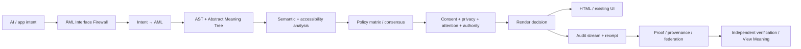

# ĀML™ — ĀRU Meaning Language™

## The accountability layer between AI and the human interface.

[](https://github.com/aruintelligence/aml-core/actions/workflows/ci.yml)
[](https://aruintelligence.github.io/aml-core/proof.html?attention=5&restoration=1&lang=en)
[](https://aruintelligence.github.io/aml-core/playground.html)
[](https://aruintelligence.github.io/aml-core/view-meaning.html)
[](https://aruintelligence.github.io/aml-core/official-aml.html)
[](https://github.com/aruintelligence/aml-core/releases/tag/v1.3.0)
[](https://github.com/aruintelligence/aml-core/releases/tag/v1.4.0-rc.2)
[](LICENSE)

**AI can propose an interface. ĀML can make its meaning, policy, authority, and evidence inspectable before and after rendering.**

> **HTML tells the browser what to display. ĀML tells the system why it deserves to be displayed.**

ĀML is a working research prototype for meaning-native, policy-aware, accountable AI interfaces. It does **not** require replacing HTML, React, or existing frontend stacks. It can sit between machine intent and human-facing output as an **AI Interface Firewall™**.

**Release status:** `v1.3.0` remains the stable package/CLI/capability contract. `v1.4.0-rc.2` is the current GitHub prerelease snapshot of the broader architecture on `main`. It is not a claim that a stable v1.4 registry package has already shipped.

## Three ways in

### TRY IT

Open the proof and change one number:

https://aruintelligence.github.io/aml-core/proof.html?attention=5&restoration=1&lang=en

### READ IT

Start with the public reading room:

**[ĀML Publications →](PUBLICATIONS.md)**

Recommended first reads:

- [Start Here — ĀML in 5 minutes](publications/START_HERE.md)
- [ĀML in one page](publications/AML_IN_ONE_PAGE.md)
- [Why AI-generated UI needs a firewall](publications/WHY_AI_UI_NEEDS_A_FIREWALL.md)
- [A critic's guide to ĀML](publications/CRITICS_GUIDE.md)
- [Enterprise buyer brief](publications/ENTERPRISE_BUYER_BRIEF.md)

### INTEGRATE IT

- [Developer integration brief](publications/DEVELOPER_INTEGRATION_BRIEF.md)
- [10-minute reproduction](docs/TRY_AML_10_MINUTES.md)
- [30-minute enterprise pilot](pilots/enterprise-30min/)
- [Verify AML without trusting AML](VERIFY.md)

## Start with proof

1. **Open the live proof:** https://aruintelligence.github.io/aml-core/proof.html?attention=5&restoration=1&lang=en
2. Watch the same interface decision show **SUPPRESS**.
3. Change `restoration_value` from `1` to `5`.
4. Watch it become **ALLOW**.
5. Copy the exact proof URL and send it to someone else.
6. Reproduce the deterministic receipt locally with [demos/undeniable-proof/](demos/undeniable-proof/).

Prototype rule:

```text
render_allowed = restoration_value >= attention_cost
```

The scores are declared/model inputs in this prototype, not claimed objective measurements of human cognition or wellbeing.

## Start in 60 seconds

- **Publications:** [PUBLICATIONS.md](PUBLICATIONS.md)
- **Proof:** https://aruintelligence.github.io/aml-core/proof.html
- **Decision gallery:** https://aruintelligence.github.io/aml-core/gallery.html
- **Zero-install `<aml-gate>` demo:** https://aruintelligence.github.io/aml-core/aml-gate-demo.html
- **Existing-HTML bridge demo:** https://aruintelligence.github.io/aml-core/dom-gate-demo.html
- **Offline single-file proof:** https://aruintelligence.github.io/aml-core/offline-proof.html
- **Try AML:** https://aruintelligence.github.io/aml-core/playground.html
- **View Meaning™:** https://aruintelligence.github.io/aml-core/view-meaning.html
- **Verify Official AML:** https://aruintelligence.github.io/aml-core/official-verify.html
- **Why AML Now:** [docs/WHY_AML_NOW.md](docs/WHY_AML_NOW.md)
- **10-minute reproduction:** [docs/TRY_AML_10_MINUTES.md](docs/TRY_AML_10_MINUTES.md)
- **Out-of-the-box adoption:** [docs/OUT_OF_THE_BOX.md](docs/OUT_OF_THE_BOX.md)
- **30-minute enterprise pilot:** [pilots/enterprise-30min/](pilots/enterprise-30min/)
- **Full JavaScript API:** [API.md](API.md)
- **v1.4 RC2 notes:** [RELEASE_NOTES_1.4.0_RC2.md](RELEASE_NOTES_1.4.0_RC2.md)

### Zero-install browser entry

```html
<script type="module">
  import { compileSourceBrowser } from "https://aruintelligence.github.io/aml-core/aml-browser.js";

  const result = compileSourceBrowser(`transmission "demo" {
    message "welcome" {
      purpose: "Explain the interface"
      attention_cost: 1
      restoration_value: 3
    }
  }`);

  console.log(result.amt);
  console.log(result.renderDecisions);
</script>
```

### One wrapper around existing HTML

```html
<script type="module" src="https://aruintelligence.github.io/aml-core/aml-gate.js"></script>

<aml-gate
  purpose="Create urgency"
  attention-cost="5"
  restoration-value="1">
  <button>Act now</button>
</aml-gate>
```

See [docs/AML_GATE_ELEMENT.md](docs/AML_GATE_ELEMENT.md).

### Or keep the DOM and add three attributes

```html
<script type="module" src="https://aruintelligence.github.io/aml-core/aml-dom-gate.js"></script>

<div
  data-aml-purpose="Create urgency"
  data-aml-attention-cost="5"
  data-aml-restoration-value="1">
  Offer expires soon.
</div>
```

See [docs/HTML_BRIDGE.md](docs/HTML_BRIDGE.md).

The two browser bridges are deliberately narrow adoption surfaces. They do not claim to contain the full runtime policy, consent, privacy, accessibility, receipt, or trust stack.

## Proof can travel

- Exact score state is encoded in the proof URL.
- The proof URL can also carry language and declared purpose.
- Live proof UI currently supports English, Spanish, Portuguese (Brazil), Hindi, Arabic, Chinese, French, and German.
- Arabic switches to RTL.
- [proof-card.html](https://aruintelligence.github.io/aml-core/proof-card.html) provides an embeddable proof surface.
- [proof-badge.svg](https://aruintelligence.github.io/aml-core/proof-badge.svg) means only **proof available**; it is not a certification badge.
- [proof-manifest.json](https://aruintelligence.github.io/aml-core/proof-manifest.json) and [proof-links.json](https://aruintelligence.github.io/aml-core/proof-links.json) make proof machine-readable.
- [`.well-known/aml.json`](https://aruintelligence.github.io/aml-core/.well-known/aml.json) is an experimental reference-project discovery convention, not a ratified Internet standard.

## The core execution model



## What AML can do today

### Meaning and policy

- lexer/parser + AST + Abstract Meaning Tree
- semantic diffs and semantic risk scoring
- policy diffs and multi-policy matrices
- policy consensus with explicit dissent
- pluggable policies and user/organization profiles
- deterministic machine-intent → AML generation

### Human-context controls

- consent-aware and privacy-aware policies
- expiring/revocable consent ledger
- reduced-motion, contrast, keyboard, text-alternative, and cognitive-load audits
- cumulative session attention accounting

### Accountability evidence

- execution receipts
- Ed25519-signed receipts
- signed data-only policy packs
- SHA-256 runtime audit streams
- signed audit checkpoints
- execution provenance graphs
- Merkle-batched receipt inclusion proofs
- Proof-Carrying Interface™ manifests

### Federated trust

- capability negotiation
- portable policy passports
- content-addressed artifact bundles
- selective-disclosure commitments
- versioned `aml-wire/1` envelopes
- replay protection
- causal execution graphs
- canonical JSON + golden protocol vectors
- trust delegation
- M-of-N threshold authorization
- bounded signed capability tokens
- transparency logs
- revocation registries

### Mainstream adoption surfaces

- public publication library for developers, designers, AI teams, security/privacy, research, enterprise, and media
- shareable exact-state proof URLs
- eight-language live proof with Arabic RTL
- embeddable proof card + proof-available badge
- decision gallery with five ALLOW / five SUPPRESS examples
- zero-install `<aml-gate>` custom element
- existing-HTML `data-aml-*` bridge
- single-file offline proof demonstrator
- machine-readable proof discovery
- AI Interface Firewall™
- React-compatible accountable UI adapter
- plain JavaScript / React / Next.js starters
- dependency-free HTTP evaluation service
- Meaning Gate™ GitHub Action
- View Meaning™ browser inspector
- privacy-minimal Manifest V3 View Meaning extension prototype
- 30-minute enterprise pilot kit

## AI Interface Firewall™

```js
import { createInterfaceFirewall } from "./index.js";

const firewall = createInterfaceFirewall({ profile: "human_first" });
const result = firewall.enforce({
  transmission: "pricing_assistant",
  nodes: [{
    type: "message",
    identifier: "pricing",
    properties: {
      purpose: "Explain pricing clearly",
      content: "Simple pricing",
      attention_cost: 1,
      restoration_value: 2
    }
  }]
});

if (result.allowed) render(result.html);
```

The result can carry policy decisions, accessibility analysis, provenance, attention accounting, audit state, and a verifiable execution receipt.

## View Meaning™

The web gave developers **View Source**. ĀML explores **View Meaning™**.

```js
import { viewMeaning } from "./index.js";
const report = viewMeaning(receipt);
```

A View Meaning report can expose declared purpose, policy/profile, consent/privacy/accessibility context, attention/restoration inputs, allow/suppress outcome, rationale, and receipt integrity.

Browser inspector: https://aruintelligence.github.io/aml-core/view-meaning.html

The extension prototype under `extensions/view-meaning/` performs user-invoked active-tab inspection, recomputes receipt integrity locally, and can verify official-brand credentials against the canonical public ĀRU trust-root registry.

## Meaning Gate™

```yaml
- uses: aruintelligence/aml-core/actions/meaning-gate@main
  with:
    before-file: before.aml
    after-file: after.aml
    before-policy: calm_default
    after-policy: human_first
```

The gate can surface or block high-risk semantic changes, new personal-data collection, consent changes, attention/restoration changes, and policy regressions.

## Run AML as a service

```bash
npm run serve
# http://127.0.0.1:8787
```

Reference HTTP endpoints and the official-verification contract are documented in [protocol/aml-http.openapi.yaml](protocol/aml-http.openapi.yaml).

The reference service does not replace production authentication, authorization, TLS, rate limiting, logging, network controls, or secure secret management.

## Open technology. Controlled official identity.

The covered software is available under the [MIT License](LICENSE). Official ĀML™ / ĀRU™ branding, logos, compatibility branding, certification-style identity, endorsement, OEM/co-branding, and related reserved brand rights are separate from the software license.

Technical conformance is independently testable. It does **not** automatically grant official authorization, endorsement, partnership, certification, or trademark rights.

Official resources:

- [TRADEMARKS.md](TRADEMARKS.md)
- [OFFICIAL_MARKS.json](OFFICIAL_MARKS.json)
- [OFFICIAL_AUTHORIZATIONS.json](OFFICIAL_AUTHORIZATIONS.json)
- [BRAND_TRUST_ROOTS.json](BRAND_TRUST_ROOTS.json)
- [COMMERCIAL.md](COMMERCIAL.md)
- [RFC 0011 — Official Brand Authorization](rfcs/0011-official-brand-authorization.md)
- [Trademark registration plan](TRADEMARK_REGISTRATION_PLAN.md)

Commercial, OEM, enterprise, and strategic inquiries: **Office@aruintelligence.com**

## Cryptographically verifiable official AML authorization

After an appropriate written agreement, ĀRU can issue a scoped `aml-brand-authorization/1` credential.

```bash
aml sign-brand-authorization authorization.json aru-private-key.pem credential.json
aml verify-brand-authorization credential.json revocation-registry.json
aml-brand-verify credential.json BRAND_TRUST_ROOTS.json
```

A credential can be cryptographically valid while still **not** being an official ĀRU authorization. Official verification additionally requires its signer fingerprint to be active and non-revoked in the canonical public trust-root registry.

Current production public trust root:

- key id: `aru-aml-brand-prod-2026-09-08-01`
- public SHA-256 fingerprint: `eda0184568cb2110add5130d2a9fffaf53a77e0f2be311be414e7912ed69997c`
- public key: [keys/aru-aml-brand-prod-2026-09-08-01-public.pem](keys/aru-aml-brand-prod-2026-09-08-01-public.pem)

Production private signing material is intentionally kept outside GitHub.

## Standards and independent implementation

AML publishes a standards-oriented surface rather than requiring other runtimes to copy implementation internals:

- RFCs 0001–0011
- protocol discovery and registry
- JSON Schemas
- canonical serialization rules
- golden protocol vectors
- conformance fixtures
- layered compatibility levels: Core, Accountable, Federated, Verifiable, Governed
- explicit governance and standardization path
- independent second-runtime challenge

See [ECOSYSTEM.md](ECOSYSTEM.md), [STANDARDIZATION.md](STANDARDIZATION.md), and [rfcs/README.md](rfcs/README.md).

## Quality gates

Every push runs repository-link checks, automated tests, deterministic receipt replay, balanced ALLOW/SUPPRESS fixture checks, public proof-surface guards, mainstream publication guards, verifier-contract drift checks, compiler verification, build-integrity verification, validation, semantic lint, explain/inspect checks, and benchmarks. A separate AML Conformance workflow verifies the public conformance surface.

## Security

Security scope includes compiler/parser behavior, policy bypasses, receipt/signature integrity, wire replay, capability escalation, revocation, official trust-root verification, HTTP behavior, and browser-extension permission/privacy boundaries.

See [SECURITY.md](SECURITY.md) and [SECURITY_THREAT_MODEL.md](SECURITY_THREAT_MODEL.md).

## Evidence boundary

ĀML improves **inspectability, policy control, reproducibility, interoperability, and cryptographic integrity**.

It does not establish that current attention/restoration values objectively measure human cognition or wellbeing; it does not make an AI's declared intent truthful; its accessibility mechanisms do not replace WCAG conformance or assistive-technology testing; and cryptographic signatures do not prove moral correctness or institutional trustworthiness.

## The question

> **When AI generates an interface, can the system prove what it meant, what authority it had, which policies governed it, and why the human saw the result?**

Created by **Daniel Jacob Read IV** and stewarded by **ĀRU Intelligence Inc.™**.

ĀML™, ĀRU Meaning Language™, AI Interface Firewall™, View Meaning™, Meaning Gate™, EthicalRenderGate™, Meaning-Native Computing™, Proof-Carrying Interface™, and named ĀML compatibility marks are claimed marks. Registration status varies; do not use ® unless a specific mark is actually registered for the relevant goods/services.
