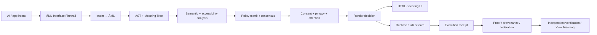

# ĀML™ — ĀRU Meaning Language™

## The accountability layer between AI and the human interface.

[](https://github.com/aruintelligence/aml-core/actions/workflows/ci.yml)
[](https://aruintelligence.github.io/aml-core/playground.html)
[](https://aruintelligence.github.io/aml-core/view-meaning.html)
[](https://aruintelligence.github.io/aml-core/official-aml.html)
[](https://github.com/aruintelligence/aml-core/releases/tag/v1.3.0)
[](https://github.com/aruintelligence/aml-core/releases/tag/v1.4.0-rc.1)
[](LICENSE)

**AI can propose an interface. ĀML decides what it means, which policies apply, whether it should render, and what proof trail must exist afterward.**

> **HTML tells the browser what to display. ĀML tells the system why it deserves to be displayed.**

ĀML is a working research prototype for meaning-native, policy-aware, accountable AI interfaces. It does **not** require replacing HTML or React. It can sit in front of existing UI as an **AI Interface Firewall™**.

**Release status:** v1.3.0 remains the stable package/CLI/capability contract. `main` contains the broader v1.4 release-candidate architecture. The public `v1.4.0-rc.1` snapshot is a prerelease, not a claim that a stable v1.4 package has already been published.

## Start in 60 seconds

- **Zero-install browser use:** [examples/browser-drop-in.html](examples/browser-drop-in.html)
- **Out-of-the-box guide:** [docs/OUT_OF_THE_BOX.md](docs/OUT_OF_THE_BOX.md)
- **Try AML:** https://aruintelligence.github.io/aml-core/playground.html
- **Inspect a receipt with View Meaning™:** https://aruintelligence.github.io/aml-core/view-meaning.html
- **Verify official AML authorization:** https://aruintelligence.github.io/aml-core/official-verify.html
- **Official AML / licensing / partnerships:** https://aruintelligence.github.io/aml-core/official-aml.html
- **v1.4 release-candidate notes:** [RELEASE_NOTES_1.4.0_RC1.md](RELEASE_NOTES_1.4.0_RC1.md)
- **30-minute enterprise pilot:** [pilots/enterprise-30min/](pilots/enterprise-30min/)
- **Run AML as an HTTP service:** `npm run serve`
- **Read the AI Interface Firewall™ guide:** [docs/AI_INTERFACE_FIREWALL.md](docs/AI_INTERFACE_FIREWALL.md)
- **See all capabilities:** [AML_CAPABILITIES.json](AML_CAPABILITIES.json)

## Open technology. Controlled official brand.

The software in this repository is available under the [MIT License](LICENSE). The official ĀML™ / ĀRU™ brand, logos, compatibility branding, certification-style marks, and endorsement rights are separate.

That means developers can experiment, integrate, fork, and implement the open technology while the official commercial identity remains controlled.

- Brand-use policy: [TRADEMARKS.md](TRADEMARKS.md)
- Machine-readable claimed marks: [OFFICIAL_MARKS.json](OFFICIAL_MARKS.json)
- Public authorization index: [OFFICIAL_AUTHORIZATIONS.json](OFFICIAL_AUTHORIZATIONS.json)
- Canonical ĀRU trust roots: [BRAND_TRUST_ROOTS.json](BRAND_TRUST_ROOTS.json)
- Published production verification key: [keys/aru-aml-brand-prod-2026-09-08-01-public.pem](keys/aru-aml-brand-prod-2026-09-08-01-public.pem)
- Commercial licensing / official badge / OEM / partnership: [COMMERCIAL.md](COMMERCIAL.md)
- Signed official authorization protocol: [RFC 0011](rfcs/0011-official-brand-authorization.md)
- Federal registration plan: [TRADEMARK_REGISTRATION_PLAN.md](TRADEMARK_REGISTRATION_PLAN.md)
- Conformance vs. official compatibility branding: [docs/CONFORMANCE_BADGE.md](docs/CONFORMANCE_BADGE.md)

**Technical conformance is reproducible. Official certification, endorsement, co-branding, and commercial use of reserved marks require separate authorization where applicable.**

Commercial, OEM, enterprise, and strategic inquiries: **Office@aruintelligence.com**

### Zero-install browser module

```html
<script type="module">
  import { compileSourceBrowser } from "https://aruintelligence.github.io/aml-core/aml-browser.js";

  const result = compileSourceBrowser(`transmission "demo" {
    message "welcome" {
      purpose: "Explain the interface"
      attention_cost: 1
      restoration_value: 3
    }
  }`);

  console.log(result.amt);
  console.log(result.renderDecisions);
</script>
```

That path works directly in a modern browser; no package installation is required for the first AML experience.

## AI Interface Firewall™

After cloning the repository, the public JavaScript API can be used directly:

```js
import { createInterfaceFirewall } from "./index.js";

const firewall = createInterfaceFirewall({ profile: "human_first" });

const result = firewall.enforce({
  transmission: "pricing_assistant",
  nodes: [{
    type: "message",
    identifier: "pricing",
    properties: {
      purpose: "Explain pricing clearly",
      content: "Simple pricing",
      attention_cost: 1,
      restoration_value: 2
    }
  }]
});

if (result.allowed) render(result.html);
```

The result carries policy decisions, accessibility analysis, provenance, attention accounting, runtime audit state, and a verifiable execution receipt.

## Run AML as an HTTP accountability service

ĀML can sit between an AI backend and any frontend stack without requiring the application to import compiler internals.

```bash
npm run serve
# http://127.0.0.1:8787
```

Reference endpoints include:

- `GET /health`
- `GET /v1/capabilities`
- `POST /v1/evaluate`
- `POST /v1/verify-receipt`
- AML trust-root / official-authorization verification endpoints documented in the OpenAPI contract

OpenAPI contract: [protocol/aml-http.openapi.yaml](protocol/aml-http.openapi.yaml)

The reference service is dependency-free and intended as a local/reference integration surface. Production deployments still need normal authentication, authorization, rate limits, transport security, key management, logging, and application security.

## React adoption without rewriting the app

```jsx
import React from "react";
import { createAccountableUI } from "./adapters/react.js";

const AccountableUI = createAccountableUI(React);

<AccountableUI
  id="pricing"
  purpose="Help the user understand pricing"
  attentionCost={1}
  restorationValue={2}
  policy="human_first"
  fallback={<p>Withheld by policy.</p>}
>
  <ExistingPricingComponent />
</AccountableUI>
```

The adapter converts ordinary component metadata into canonical ĀML intent and sends it through the same accountability pipeline as native `.aml` source.

## View Meaning™

The web gave developers **View Source**. ĀML introduces **View Meaning™**.

```js
import { viewMeaning } from "./index.js";

const meaning = viewMeaning(result.receipt);
```

A View Meaning report can expose:

- declared purpose
- policy/profile
- attention cost
- restoration value
- consent/privacy/accessibility context
- allow/suppress outcome
- policy rationale
- receipt integrity
- audit/attention hashes

Browser inspector: https://aruintelligence.github.io/aml-core/view-meaning.html

The repository also includes a privacy-minimal Manifest V3 browser-extension prototype under `extensions/view-meaning/` that locally recomputes receipt integrity and can verify AML brand credentials against the canonical ĀRU trust-root registry.

## Meaning Gate™ for pull requests

ĀML can stop semantic regressions before deployment.

```yaml
- uses: aruintelligence/aml-core/actions/meaning-gate@main
  with:
    before-file: before.aml
    after-file: after.aml
    before-policy: calm_default
    after-policy: human_first
```

The gate can block:

- high-risk meaning changes
- new personal-data collection
- changed consent requirements
- attention/restoration changes
- policy regressions from ALLOW → SUPPRESS

Direct runner:

```bash
node scripts/meaning-gate.js before.aml after.aml calm_default human_first
```

## Signed official AML authorization

Open-source software rights and official brand rights are deliberately separate.

After an appropriate written agreement, ĀRU can issue a signed `aml-brand-authorization/1` credential that identifies the grantee, authorized marks, permitted uses, agreement reference, expiration, issuing public key, and revocable credential hash.

```bash
aml sign-brand-authorization authorization.json aru-private-key.pem credential.json
aml verify-brand-authorization credential.json revocation-registry.json
aml-brand-verify credential.json BRAND_TRUST_ROOTS.json
```

The first two checks establish credential cryptographic validity. The `aml-brand-verify` path adds canonical ĀRU trust-root membership.

**A self-signed credential can be cryptographically valid and still not be an official ĀRU authorization.** Official verification requires the signer fingerprint to be active in `BRAND_TRUST_ROOTS.json` and not revoked.

The production private signing key is intentionally kept outside GitHub.

## What exists today

Stable v1.3 plus the v1.4 release-candidate surface on `main` currently includes:

- lexer + parser
- AST + Abstract Meaning Tree
- compiler to browser-compatible HTML
- pluggable policy engines
- user/organization policy profiles
- policy consensus with explicit dissent
- semantic diffs + semantic risk scoring
- policy diffs + policy matrices
- AI intent → deterministic ĀML generation
- AI Interface Firewall™
- dependency-free HTTP evaluation service + OpenAPI contract
- 30-minute enterprise pilot kit
- React-compatible adapter
- View Meaning™ API + browser inspector + extension prototype
- GitHub Meaning Gate™ action
- Verify Official ĀML GitHub Action
- consent + privacy policies
- expiring/revocable consent ledger
- accessibility policies + audits
- cumulative attention accounting
- signed policy packs
- runtime SHA-256 audit streams
- signed audit checkpoints
- execution provenance graphs
- Merkle-batched execution receipts
- Ed25519-signed execution receipts
- cross-runtime capability negotiation
- portable policy passports
- content-addressed AML bundles
- selective-disclosure commitments
- federated AML exchange
- causal execution graphs
- canonical JSON + protocol vectors
- delegated trust chains
- threshold authorization
- transparency logs
- bounded signed capability tokens
- wire replay protection
- revocation registry
- Proof-Carrying Interface™ manifests
- signed official brand-authorization credentials
- canonical ĀRU brand trust roots
- machine-verifiable conformance claims
- layered conformance through AML Governed Compatible™
- RFC/process/registry/schema standards surface
- CLI + JavaScript API
- browser playground
- VS Code language support
- LSP server
- CI + conformance fixtures

## Execution architecture



## Built-in profiles

| Profile | Focus |
|---|---|
| `calm_default` | restoration + consent |
| `strict_attention` | conservative attention + consent + budget |
| `privacy_first` | restoration + consent + privacy + budget |
| `accessibility_first` | motion + contrast + cognitive load + budget |
| `human_first` | broad privacy + consent + accessibility + attention controls |

## Developer surface

| Resource | Purpose |
|---|---|
| [Out of the Box](docs/OUT_OF_THE_BOX.md) | Browser, app, React, CI adoption paths |
| [30-Minute Enterprise Pilot](pilots/enterprise-30min/) | Existing-app pilot without a rewrite |
| [AML HTTP OpenAPI](protocol/aml-http.openapi.yaml) | Framework-independent service contract |
| [AI Interface Firewall](docs/AI_INTERFACE_FIREWALL.md) | Adopt AML inside existing apps |
| [Playground](https://aruintelligence.github.io/aml-core/playground.html) | Type AML and inspect compiler structures |
| [View Meaning](https://aruintelligence.github.io/aml-core/view-meaning.html) | Inspect accountable execution receipts |
| [Verify Official AML](https://aruintelligence.github.io/aml-core/official-verify.html) | Check credential integrity + canonical ĀRU trust-root status |
| [Official AML](https://aruintelligence.github.io/aml-core/official-aml.html) | Licensing, official branding, OEM, partnerships |
| [JavaScript API](API.md) | Full programmatic API |
| [Quickstart](QUICKSTART.md) | Clone, test, compile, inspect |
| [v1.4 RC Notes](RELEASE_NOTES_1.4.0_RC1.md) | Public post-v1.3 architecture snapshot |
| [Roadmap](ROADMAP.md) | Current stable, v1.4 candidate, and next adoption priorities |
| [90-Day Adoption Plan](ADOPTION_90_DAYS.md) | Distribution, independent credibility, enterprise adoption |
| [Ecosystem Map](ECOSYSTEM.md) | Adoption, standards, conformance, security, and extension surfaces |
| [Trust Continuity](docs/TRUST_CONTINUITY.md) | Consent history, provenance, policy dissent, Merkle receipts |
| [v1.3 Architecture](docs/V1_3_BREAKTHROUGH.md) | Signed policies, diffs, audit streams, accessibility, attention |
| [Capabilities](AML_CAPABILITIES.json) | Machine-readable stable platform surface |
| [Protocol Discovery](protocol/discovery.json) | Machine-readable interoperability discovery |
| [Conformance](CONFORMANCE.json) | Canonical compatibility entry point |
| [Replication](REPLICATION.md) | Independent reproduction protocol |
| [Official Marks](OFFICIAL_MARKS.json) | Machine-readable public mark status |
| [Trademark Policy](TRADEMARKS.md) | Open implementation vs. controlled official brand |
| [Commercial Program](COMMERCIAL.md) | Official branding, enterprise, OEM, partnerships |

## Quality gates

Every push checks local documentation links, automated tests, compiler output, bundle integrity, validation, semantic lint, explanation output, inspectable decisions, and benchmarks. A dedicated AML Conformance workflow separately validates the public conformance surface.

## Evidence boundary

ĀML improves **inspectability, policy control, reproducibility, interoperability, and cryptographic integrity**. It does not establish that its present attention/restoration scores objectively measure human cognition or wellbeing; it does not make an AI's declared intent truthful; and its accessibility policies do not replace WCAG conformance or assistive-technology testing.

Cryptographic signatures prove integrity and key possession—not moral correctness or institutional trustworthiness.

## The question

> What changes when AI-generated interfaces must declare meaning, pass user-owned policy, respect consent/privacy/accessibility/attention constraints, and produce a verifiable receipt before reaching a person?

Created by **Daniel Jacob Read IV** and stewarded by **ĀRU Intelligence Inc.™**

Code is available under the [MIT License](LICENSE). Brand and certification rights are separate from the software license. See [TRADEMARKS.md](TRADEMARKS.md) and [COMMERCIAL.md](COMMERCIAL.md).

ĀML™, ĀRU Meaning Language™, AI Interface Firewall™, View Meaning™, Meaning Gate™, EthicalRenderGate™, Meaning-Native Computing™, Proof-Carrying Interface™, and the named ĀML compatibility marks are claimed marks. Registration status varies; do not use ® unless a specific mark is actually registered for the relevant goods/services.
