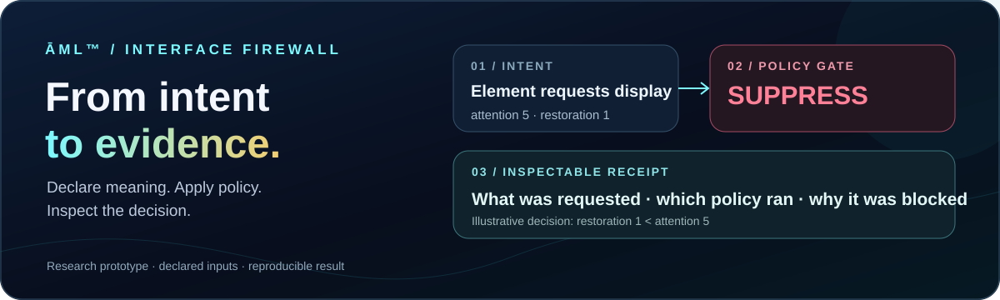
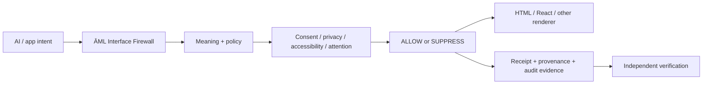

<div align="center">
  
</div>

# ĀML™ — ĀRU Meaning Language™

## The accountability layer between AI and the human interface.

[](https://github.com/aruintelligence/aml-core/actions/workflows/ci.yml)
[](https://aruintelligence.github.io/aml-core/proof.html?attention=5&restoration=1&lang=en)
[](https://github.com/aruintelligence/aml-core/releases/tag/v1.3.0)
[](https://github.com/aruintelligence/aml-core/releases/tag/v1.4.0-rc.2)
[](LICENSE)

**AI can propose an interface. ĀML can make its meaning, policy, authority, and evidence inspectable before and after rendering.**

> **HTML tells the browser what to display. ĀML tells the system why it deserves to be displayed.**

ĀML is a working research prototype for meaning-native, policy-aware, accountable AI interfaces. It can sit between machine intent and human-facing output as an **AI Interface Firewall™** without requiring teams to replace HTML, React, or existing frontend stacks.

| Try the decision | Verify the evidence | Integrate a path |
|---|---|---|
| [**60-second live proof**](https://aruintelligence.github.io/aml-core/proof.html?attention=5&restoration=1&lang=en) — change one declared value and watch SUPPRESS become ALLOW. | [**30-minute enterprise pilot**](pilots/enterprise-30min/README.md) — replay receipts, inspect fixture hashes, and reject a mutation. | [**Consumer quickstart**](docs/CONSUMER_QUICKSTART.md) — run an installed-package rehearsal in a clean directory. |

**Explore the interface:** [Live lab](https://aruintelligence.github.io/aml-core/) · [View Meaning™ inspector](https://aruintelligence.github.io/aml-core/view-meaning.html) · [API contract](protocol/aml-http.openapi.yaml)

## Prove the core claim in 60 seconds

Open this exact state: [**attention 5 / restoration 1 → SUPPRESS**](https://aruintelligence.github.io/aml-core/proof.html?attention=5&restoration=1&lang=en).

Now change `restoration` from `1` to `5`: [**attention 5 / restoration 5 → ALLOW**](https://aruintelligence.github.io/aml-core/proof.html?attention=5&restoration=5&lang=en).

Prototype rule:

```text
render_allowed = restoration_value >= attention_cost
```

The attention/restoration scores are declared or model-supplied prototype inputs. They are **not** claimed objective measurements of cognition, wellbeing, morality, or clinical state.

If the behavior does not reproduce, that is useful evidence. Please publish **PASS / FAIL / MIXED** with enough detail for someone else to repeat your result.

- [Independent verification call](https://github.com/aruintelligence/aml-core/issues/88)
- [Witness protocol](publications/AML_WITNESS_PROTOCOL.md)
- [Evidence levels](EVIDENCE.md)
- [Verification guide](VERIFY.md)

## Field experiments — real customer-facing websites

ĀRU Intelligence is actively applying ĀML™ to real customer-facing web properties, including a multi-site Security First Alarm pilot. These are **project-authored field experiments**, not synthetic mockups and not independent validation.

The current work preserves pre-change checkpoints, identifies exact interface elements under test, records label provenance and declared policy inputs, and is designed to publish before/after evidence and decision receipts as each site experiment is completed.

- **Active pilot registry:** [`experiments/2026-09-12/SECURITY_WEBSITE_FIELD_PILOTS.md`](experiments/2026-09-12/SECURITY_WEBSITE_FIELD_PILOTS.md)
- **Public field-experiments page:** [ARUIntelligence.com/experiments](https://aruintelligence.com/experiments)
- **Independent verification call:** [Issue #88](https://github.com/aruintelligence/aml-core/issues/88)

Important boundary: site-specific phone numbers, SMS routing, email addresses, and business-contact rules are preserved as local ground truth. The experiment evaluates presentation and repetition, not arbitrary normalization of contact data.

The attention/restoration values used in these pilots are declared or model-supplied prototype inputs. They are **not** claimed objective measurements of cognition, wellbeing, psychology, neurological state, morality, or clinical outcome.

**Do not endorse ĀML first. Verify it first.**

## Reproduce it locally

```bash
git clone https://github.com/aruintelligence/aml-core.git
cd aml-core
npm install
npm test
```

For the smallest deterministic reproduction, start with:

- [10-minute reproduction](docs/TRY_AML_10_MINUTES.md)
- [Five-minute installed-package quickstart](docs/CONSUMER_QUICKSTART.md)
- [Preserve a decision](docs/EVIDENCE_CAPSULE.md) — create and recheck a self-contained evidence capsule after an interface changes.
- [Renew its evidence](docs/EVIDENCE_RENEWAL.md) — link the original capsule into an append-only SHA3-512 chain with verifier-trusted witness quorum.
- [Keep a cold archive](docs/EVIDENCE_ARCHIVE.md) — preserve canonical capsule and renewal bytes with an offline recovery path and externally supplied trust.
- [Recheck a versioned handoff](docs/EVIDENCE_MIGRATION.md) — retain v1 bytes in a v2 layout and verify exact component equivalence before recovery.
- [Repair a cold storage handoff](docs/EVIDENCE_SHARDS.md) — reconstruct canonical handoff bytes from any two of three separately stored shares, then recheck external trust.
- [Rehearse every recovery pair](docs/EVIDENCE_DRILL.md) — get a machine-readable readiness report before a damaged share becomes a loss.
- [Simulate storage failures](docs/EVIDENCE_PLACEMENT.md) — reveal declared shared sites, infrastructure, and custodians that can defeat two-of-three recovery.
- [Explore the visual Resilience Lab](https://aruintelligence.github.io/aml-core/resilience-lab.html) — select a failure to see its blast radius, reopen a local placement manifest, and take that manifest to the verified CLI drill.
- [Undeniable proof demo](demos/undeniable-proof/)
- [Benchmarking protocol](BENCHMARKING.md)
- [Interoperability challenge](INTEROPERABILITY.md)

Project-authored tests are useful engineering evidence, but they do **not** count as independent external verification.

## What ĀML is trying to make explicit

A generated interface usually has several hidden questions behind it:

1. **What did the system intend to show?**
2. **Which policy allowed or blocked it?**
3. **What authority or consent applied?**
4. **What evidence explains the decision?**
5. **Can another implementation reproduce the result?**

ĀML turns those questions into inspectable data and deterministic decisions that can travel with the interface.


```mermaid
flowchart LR
    A[AI / app intent] --> B[ĀML Interface Firewall]
    B --> C[Meaning + policy]
    C --> D[Consent / privacy / accessibility / attention]
    D --> E[ALLOW or SUPPRESS]
    E --> F[HTML / React / other renderer]
    E --> G[Receipt + provenance + audit evidence]
    G --> H[Independent verification]
```

## Three ways to use the project

### 1. Understand it

- [ĀML in one page](publications/AML_IN_ONE_PAGE.md)
- [Start Here — ĀML in 5 minutes](publications/START_HERE.md)
- [Why AI-generated UI needs a firewall](publications/WHY_AI_UI_NEEDS_A_FIREWALL.md)
- [A critic's guide to ĀML](publications/CRITICS_GUIDE.md)
- [Publications index](PUBLICATIONS.md)

### Evaluate it with a reproducible enterprise pilot

Run the [30-minute enterprise pilot](pilots/enterprise-30min/README.md) to generate a decision report with full receipts, declared fixture hashes, three asserted outcomes, deterministic replay, and a tamper-rejection check. The CI workflow saves the report for review. This is project-authored evidence, with explicit deployment and claim boundaries.

### 2. Put it in front of an existing interface

Zero-install custom element:

```html
<script type="module" src="https://aruintelligence.github.io/aml-core/aml-gate.js"></script>

<aml-gate
  purpose="Create urgency"
  attention-cost="5"
  restoration-value="1">
  <button>Act now</button>
</aml-gate>
```

Or keep the existing DOM and add three attributes:

```html
<script type="module" src="https://aruintelligence.github.io/aml-core/aml-dom-gate.js"></script>

<div
  data-aml-purpose="Create urgency"
  data-aml-attention-cost="5"
  data-aml-restoration-value="1">
  Offer expires soon.
</div>
```

These browser bridges are intentionally narrow adoption surfaces. They do not claim to contain the full runtime policy, consent, privacy, accessibility, receipt, or trust stack.

- [`<aml-gate>` documentation](docs/AML_GATE_ELEMENT.md)
- [Existing HTML bridge](docs/HTML_BRIDGE.md)
- [React / JavaScript / Next.js starters](starters/)

### 3. Inspect the decision

The web gave developers **View Source**. ĀML explores **View Meaning™**.

```js
import { viewMeaning } from "./index.js";
const report = viewMeaning(receipt);
```

A View Meaning report can expose declared purpose, policy/profile, consent/privacy/accessibility context, attention/restoration inputs, ALLOW/SUPPRESS outcome, rationale, provenance, and receipt integrity.

- [View Meaning™ browser inspector](https://aruintelligence.github.io/aml-core/view-meaning.html)
- [Decision gallery](https://aruintelligence.github.io/aml-core/gallery.html)
- [Offline single-file proof](https://aruintelligence.github.io/aml-core/offline-proof.html)

## What exists today

The repository currently includes:

- lexer/parser, AST, Abstract Meaning Tree, compiler, runtime, and CLI
- semantic and policy diffs
- pluggable policies and multi-policy consensus
- consent, privacy, accessibility, and attention controls
- execution receipts and Ed25519 signatures
- SHA-256 audit streams, provenance graphs, and Merkle inclusion proofs
- Proof-Carrying Interface™ manifests
- capability negotiation, policy passports, replay protection, delegation, threshold authorization, transparency logs, and revocation registries
- browser bridges, React-compatible adapters, starters, an HTTP service, Meaning Gate™ GitHub Action, and View Meaning™ tooling
- RFCs, schemas, golden vectors, conformance fixtures, benchmarking, interoperability, and evidence-reporting surfaces

See [API.md](API.md), [ECOSYSTEM.md](ECOSYSTEM.md), [rfcs/README.md](rfcs/README.md), and [STANDARDIZATION.md](STANDARDIZATION.md).

## Evidence before adoption claims

ĀML separates project-controlled evidence from independent evidence.

| Level | Meaning |
|---|---|
| E0 | concept / proposal |
| E1 | project-authored demonstration |
| E2 | automated repository verification |
| E3 | independent reproduction |
| E4 | independent implementation |
| E5 | external pilot evidence |
| E6 | production deployment evidence |
| E7 | multi-party ecosystem evidence |

The project should not describe internal tests, project-maintained reference implementations, clone counts, or outreach activity as independent adoption.

A failure, bypass, contradictory implementation, or **MIXED** result can be more valuable than praise if it reveals where the contract is weak.

## Status

- `v1.3.0` remains the stable package/CLI/capability contract.
- `v1.4.0-rc.2` is the current GitHub prerelease snapshot of the broader architecture on `main`.
- ĀML is **not** a ratified industry or Internet standard.
- No claim is made here of universal adoption, standards-body approval, third-party certification, regulatory approval, scientific validation, or production suitability for every environment.

## Security and production boundary

The reference implementation covers parser/compiler behavior, policy bypasses, receipts/signatures, wire replay, capability escalation, revocation, official trust-root verification, HTTP behavior, and browser-extension permission/privacy boundaries.

It does not replace production authentication, authorization, TLS, rate limiting, secure secret management, application-specific threat modeling, WCAG conformance testing, or independent security review.

- [Security policy](SECURITY.md)
- [Threat model](SECURITY_THREAT_MODEL.md)
- [Security evaluation checklist](docs/SECURITY_EVALUATION_CHECKLIST.md)
- [Server-owned HTTP deployment policy](docs/LOCKED_HTTP_POLICY.md)
- [HTTP ingress authentication](docs/HTTP_INGRESS_AUTH.md)

## Open technology. Controlled official identity.

The covered software is available under the [MIT License](LICENSE). Official ĀML™ / ĀRU™ branding, logos, compatibility branding, certification-style identity, endorsement, OEM/co-branding, and related reserved brand rights are separate from the software license.

Technical conformance is independently testable. It does **not** automatically grant official ĀRU authorization, endorsement, partnership, certification, or trademark rights.

For the current rights and commercialization architecture, start here:

- [LICENSING.md](LICENSING.md) — canonical boundary between MIT-covered software and separately controlled rights/services
- [NOTICE.md](NOTICE.md) — concise public rights notice
- [TRADEMARKS.md](TRADEMARKS.md) — trademark and brand-use policy
- [COMMERCIAL.md](COMMERCIAL.md) — enterprise, OEM, managed-service, and official-branding paths
- [IP_PROTECTION_ROADMAP.md](IP_PROTECTION_ROADMAP.md) — operational checklist for registrations, chain of title, patent timing, trade-secret boundaries, contributor rights, and written agreements
- [CONTRIBUTING.md](CONTRIBUTING.md) — contribution licensing and no-silent-relicensing boundary
- [OFFICIAL_MARKS.json](OFFICIAL_MARKS.json)
- [OFFICIAL_AUTHORIZATIONS.json](OFFICIAL_AUTHORIZATIONS.json)
- [BRAND_TRUST_ROOTS.json](BRAND_TRUST_ROOTS.json)
- [RFC 0011 — Official Brand Authorization](rfcs/0011-official-brand-authorization.md)

Current production public trust root:

- key id: `aru-aml-brand-prod-2026-09-08-01`
- SHA-256 fingerprint: `eda0184568cb2110add5130d2a9fffaf53a77e0f2be311be414e7912ed69997c`
- public key: [keys/aru-aml-brand-prod-2026-09-08-01-public.pem](keys/aru-aml-brand-prod-2026-09-08-01-public.pem)

Production private signing material is intentionally kept outside GitHub.

Commercial, OEM, enterprise, and strategic inquiries: **Office@aruintelligence.com**

## The question

> **When AI generates an interface, can the system prove what it meant, what authority it had, which policies governed it, and why the human saw the result?**

Created by **Daniel Jacob Read IV** and stewarded by **ĀRU Intelligence Inc.™**.

ĀML™, ĀRU Meaning Language™, AI Interface Firewall™, View Meaning™, Meaning Gate™, EthicalRenderGate™, Meaning-Native Computing™, Proof-Carrying Interface™, and named ĀML compatibility marks are claimed marks. Registration status varies; do not use ® unless a specific mark is actually registered for the relevant goods/services.
